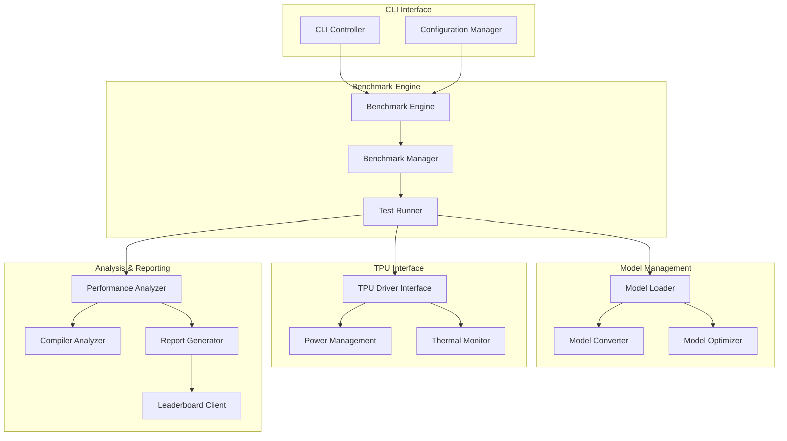

# Edge TPU v5 Benchmark Suite - Architecture

## System Overview

The Edge TPU v5 Benchmark Suite is designed as a modular, extensible framework for comprehensive performance evaluation of Google's TPU v5 edge computing cards. The architecture prioritizes accuracy, reproducibility, and extensibility while maintaining high performance.

## Core Architecture



## Component Architecture

### 1. CLI Interface Layer

**Components:**
- `cli.py`: Command-line interface and argument parsing
- `config.py`: Configuration management and validation
- `commands/`: Subcommand implementations

**Responsibilities:**
- User interaction and command parsing
- Configuration file management
- Input validation and error handling
- Progress reporting and user feedback

### 2. Benchmark Engine

**Components:**
- `benchmark.py`: Core benchmark orchestration
- `runners/`: Specific benchmark implementations
- `metrics/`: Performance metric calculations

**Data Flow:**
```python
BenchmarkEngine.run()
├── Model preparation and validation
├── TPU device initialization
├── Warmup iterations
├── Performance measurement loops
├── Power and thermal monitoring
└── Results aggregation and analysis
```

**Key Design Patterns:**
- **Strategy Pattern**: Different benchmark strategies for various model types
- **Observer Pattern**: Real-time metrics collection and monitoring
- **Factory Pattern**: Dynamic benchmark creation based on model type

### 3. Model Management System

**Components:**
- `models.py`: Model abstraction and management
- `converter.py`: Multi-format model conversion
- `optimizer.py`: TPU v5-specific optimizations

**Supported Formats:**
- ONNX → TensorFlow Lite
- PyTorch → ONNX → TFLite
- TensorFlow SavedModel → TFLite
- Direct TFLite import

**Optimization Pipeline:**
```python
ModelOptimizer.optimize()
├── Graph analysis and operator mapping
├── TPU v5 specific optimizations
│   ├── Convolution fusion
│   ├── Memory layout optimization
│   ├── Quantization strategy selection
│   └── Compute pattern matching
├── Compilation validation
└── Performance estimation
```

### 4. TPU Interface Layer

**Components:**
- `tpu_interface.py`: Low-level TPU communication
- `power.py`: Power measurement and monitoring
- `thermal.py`: Temperature monitoring

**Hardware Abstraction:**
```python
class TPUDevice:
    def __init__(self, device_path: str)
    def load_model(self, model_path: str) -> Model
    def run_inference(self, input_data: np.ndarray) -> np.ndarray
    def get_power_consumption(self) -> PowerMetrics
    def get_thermal_state(self) -> ThermalMetrics
```

### 5. Analysis & Reporting

**Components:**
- `analysis.py`: Performance analysis algorithms
- `compiler_analysis.py`: TPU v5 compiler insights
- `reports.py`: Multi-format report generation
- `leaderboard.py`: Community leaderboard integration

## Data Architecture

### Performance Metrics Schema

```python
@dataclass
class BenchmarkResults:
    model_info: ModelInfo
    system_info: SystemInfo
    performance_metrics: PerformanceMetrics
    power_metrics: PowerMetrics
    thermal_metrics: ThermalMetrics
    compiler_analysis: CompilerAnalysis
    timestamps: TimestampInfo
```

### Storage Architecture

```
results/
├── raw/                    # Raw measurement data
│   ├── {timestamp}/
│   │   ├── metrics.json
│   │   ├── power_trace.csv
│   │   └── thermal_log.csv
├── processed/              # Analyzed results
│   ├── {model_name}/
│   │   ├── summary.json
│   │   └── analysis.json
└── reports/                # Generated reports
    ├── html/
    ├── json/
    └── csv/
```

## Security Architecture

### Model Security
- **Model Validation**: Cryptographic verification of model integrity
- **Sandboxed Execution**: Isolated model execution environment
- **Input Sanitization**: Comprehensive input validation and bounds checking

### Data Protection
- **No Sensitive Data**: No collection of personally identifiable information
- **Local Processing**: All benchmarking performed locally
- **Optional Telemetry**: Opt-in anonymous performance metrics sharing

### Supply Chain Security
- **Signed Releases**: All releases cryptographically signed
- **Dependency Scanning**: Automated vulnerability scanning
- **SBOM Generation**: Software Bill of Materials for transparency

## Performance Architecture

### Optimization Strategies

1. **Memory Management**
   - Pre-allocated buffers for inference data
   - Memory-mapped model loading
   - Efficient garbage collection patterns

2. **Concurrency Model**
   - Async power monitoring
   - Parallel model preparation
   - Thread-safe metrics collection

3. **TPU v5 Specific Optimizations**
   - Batch size optimization for specific models
   - Memory layout tuning for tensor operations
   - Compiler hint utilization

### Scalability Considerations

- **Horizontal Scaling**: Multi-device benchmark execution
- **Vertical Scaling**: Efficient resource utilization on single device
- **Resource Management**: Dynamic memory and compute resource allocation

## Extensibility Architecture

### Plugin System

```python
class BenchmarkPlugin:
    def register_models(self) -> List[str]
    def run_benchmark(self, model: str, config: Dict) -> Results
    def analyze_results(self, results: Results) -> Analysis
```

### Custom Metrics

```python
class MetricCalculator:
    def calculate(self, raw_data: RawData) -> Dict[str, float]
    def validate(self, metrics: Dict[str, float]) -> bool
```

## Quality Architecture

### Testing Strategy
- **Unit Tests**: Component-level testing with 90%+ coverage
- **Integration Tests**: End-to-end benchmark validation
- **Performance Tests**: Regression testing for benchmark accuracy
- **Hardware Tests**: TPU-specific validation on real devices

### Monitoring & Observability
- **Structured Logging**: JSON-formatted logs with correlation IDs
- **Metrics Collection**: Prometheus-compatible metrics export
- **Health Checks**: Comprehensive system health validation
- **Alerting**: Performance degradation detection

## Deployment Architecture

### Development Environment
- **Docker Containers**: Consistent development environment
- **Dev Containers**: VS Code integration for seamless development
- **Pre-commit Hooks**: Automated code quality enforcement

### Production Deployment
- **PyPI Distribution**: Standard Python package distribution
- **Docker Images**: Multi-architecture container images
- **CI/CD Pipeline**: Automated testing, building, and deployment

## Configuration Architecture

### Configuration Hierarchy
1. **System Defaults**: Built-in default configurations
2. **User Config**: `~/.edge-tpu-v5-benchmark/config.yaml`
3. **Project Config**: `./benchmark-config.yaml`
4. **CLI Arguments**: Command-line parameter overrides
5. **Environment Variables**: Runtime environment overrides

### Configuration Schema
```yaml
benchmark:
  default_iterations: 1000
  warmup_iterations: 100
  timeout_seconds: 300
  
models:
  cache_directory: ~/.edge-tpu-v5-benchmark/models
  optimization_level: 2
  
hardware:
  power_sampling_rate: 1000  # Hz
  thermal_monitoring: true
  
reporting:
  output_format: [json, html]
  include_raw_data: false
  leaderboard_submission: false
```

## Future Architecture Considerations

### Planned Enhancements
1. **Multi-TPU Support**: Distributed benchmarking across multiple TPU devices
2. **Cloud Integration**: Remote benchmark execution and result aggregation
3. **ML Model Registry**: Integration with model versioning systems
4. **Advanced Analytics**: Machine learning-based performance prediction

### Scalability Roadmap
1. **Phase 1**: Single TPU v5 comprehensive benchmarking
2. **Phase 2**: Multi-device parallel execution
3. **Phase 3**: Cloud-scale distributed benchmarking
4. **Phase 4**: Real-time continuous benchmarking platform

This architecture ensures the Edge TPU v5 Benchmark Suite remains maintainable, extensible, and capable of evolving with the rapidly advancing edge AI ecosystem.